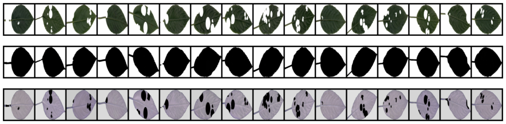

# Convolutional Neural Network for Leaf Photo Reconstruction

This project aims to build, train and use a convolutional neural network with U-Net++ architecture to calculate the area of leaf bites and use the obtained information in the framework of the research "The study of sexual dimorphism in the morphofunctional organs of _Mercurialis Perennis_". The neural network restores the photo of a leaf bitten by pests to a whole one, then the areas of the objects on 2 variants of the photo are subtracted from each other and the area of the bites is obtained.

